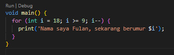
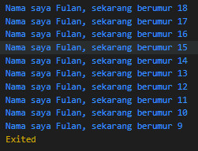

#

Nama : Ahmad Iqbal Firmansyah

NIM  : 2241760097

Kelas : SIB2B
#

1. Modifikasilah kode pada baris 3 di VS Code atau Editor Code favorit Anda berikut ini agar mendapatkan keluaran (output) sesuai yang diminta!
 Jawaban :
 
 

2. Mengapa sangat penting untuk memahami bahasa pemrograman Dart sebelum kita menggunakan framework Flutter ? Jelaskan!
 Jawaban :
    
    Karena Flutter menggunakan Dart sebagai Bahasa utama, Flutter sepenuhnya dibangun di atas bahasa pemrograman Dart. Untuk mengembangkan aplikasi dengan Flutter, maka diharuskan memahami bahasa Dart

3. Rangkumlah materi dari codelab ini menjadi poin-poin penting yang dapat Anda gunakan untuk membantu proses pengembangan aplikasi mobile menggunakan framework Flutter.
 Jawaban : 
     
* Dart dirancang untuk object-oriented (OO). Secara singkat, Bahasa OOP didasarkan pada konsep objek yang menyimpan kedua data (disebut fields) dan kode (disebut methods). Objek-objek ini dibuat dari cetak biru yang disebut class yang mendefinisikan field dan method yang akan dimiliki oleh sebuah objek.Sesuai prinsip OO memastikan bahwa Dart memiliki fitur encapsulation, inheritance, composition, abstraction, dan polymorphism.
* Di Dart, operator tidak lebih dari method yang didefinisikan dalam class dengan sintaks khusus.
* Dart hadir dengan banyak operator typical, Beberapa operator memiliki perilaku yang berbeda tergantung pada jenis operan di sisi kiri; Misalnya, operator + dapat digunakan untuk menjumlahkan variabel dari tipe num, tetapi juga dapat digunakan untuk menggabungkan string. Karena method yang dirujuk diimplementasikan secara berbeda pada kelas yang berbeda.
* Operator penambahan dan pengurangan juga merupakan operator umum dan diimplementasikan pada angka.
* Operator logika di Dart adalah operator yang diterapkan pada operan bool; bisa berupa variabel, ekspresi, atau kondisi. Selain itu, dapat dikombinasikan dengan ekspresi kompleks dengan menggabungkan nilai ekspresi yang dievaluasi.
    